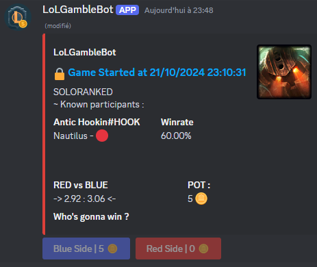

#  League of Legends Gamble Bot

  

  

## Description

League of Legends Gamble Bot is a Discord bot that lets users track Summoners and bet virtual tokens on their game outcomes. Compete with other users to become the richest player on your server by correctly predicting the results of matches.

## Features

### An Embed to show on going and ended games, with bet lock system.

### MP to track what you won / lost with linked game.

### A Scoreboard to track who is ahead on the server.

- Track League of Legends Summoners from different regions.
- Bet virtual tokens on the outcome of games involving tracked Summoners.
- Receive notifications when a tracked Summoner enters a game.
- A 3-minute betting window before each tracked game starts.
- Automated messages to notify users of the game result and their betting outcome.
- View the current scoreboard of the richest players on the server.

## Commands

Below is a table of commands available for the Discord Betting Game Bot:

| Command       | Description                                       | Parameters                                                                                      | Usage                                                          | Example                                                       |
|---------------|---------------------------------------------------|-------------------------------------------------------------------------------------------------|----------------------------------------------------------------|---------------------------------------------------------------|
| `/start`      | Tell the bot to start and notify in this channel. | None                                                                                            | `/start`                                                       | `/start`                                                      |
| `/stop`       | Tell the bot to stop sending notifications.       | None                                                                                            | `/stop`                                                        | `/stop`                                                       |
| `/add`        | Add a new Summoner to track.                      | - `summoner_region` (required): Region of the Summoner (e.g., NA, EUW).  - `summoner_name` (required): Name of the Summoner (e.g., `AAAAA#BBB`). | `/add summoner_region:<region> summoner_name:<summoner_name>`  | `/add summoner_region:NA summoner_name:Summoner123`           |
| `/remove`     | Remove a Summoner from the tracking list.         | - `summoner_region` (required): Region of the Summoner.  - `summoner_name` (required): Name of the Summoner.                         | `/remove summoner_region:<region> summoner_name:<summoner_name>` | `/remove summoner_region:EUW summoner_name:Summoner123` |
| `/list`       | Get the list of Summoners currently being tracked.| None                                                                                            | `/list`                                                        | `/list`                                                       |
| `/scoreboard` | View the current scoreboard of the richest players.| None      

## Setup

To configure LoL Gamble Bot, you need to set the following environment variables:

1. **Required Environment Variables:**
  - `LOCALE`: The [ISO 639 language](https://en.wikipedia.org/wiki/List_of_ISO_639_language_codes#:~:text=ISO%20639%20is%20a%20standardized,(sets%202%E2%80%935).) code of bot default language.
   - `DISCORD_ID`: Your Discord application ID.
   - `DISCORD_TOKEN`: Your Discord bot token.
   - `RIOT_API_KEY`: Your Riot API key.

2. **Optional Environment Variable:**
   - `RIOT_API_LIMIT_BY_MINUTES`: Defines the number of Riot API call can be made per minutes. Default is `100`.
   - `CHECK_INTERVAL`: Defines the number of seconds between summoner status check. Default is `60`.
   - `TIME_BEFORE_BET_LOCK`: Defines the time in seconds before locking bet after game start. Default is `180`.
   - `START_AMOUNT`: Defines the amount of token the player will start with. Default is `100`.
   - `CURRENCY`: Defines the name/icon of the virtual token. Default is `🪙`.
   - `SAVED_DATA_PATH`: Defines the path where all data will be stored on the server. Default is `./data`.
   - `LOG_LEVEL`: Defines the logging level of the Bot. Default is `warning`.

A Docker image is also available via [Docker Hub](https://hub.docker.com/r/pekno/lolgamblebot).

## Ideas / To do

- [x] Add locale support
- [x] Make one log file per Lurker/Guild
- [x] Add one combined error log
- [x] Make all response defered
- [x] Added hyperlink to LoG profiles
- [ ] Improve / Rework Winning odds computation
